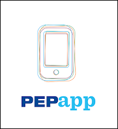

# Dialog E2E Test

## Objetivo

Desenvolver uma aplicação para consultar um App na Google Play

## Dependências permitidas

- jest
- puppeteer
- jest-puppeteer


## Configuração do teste

Como deve estar o `jest-puppeteer.config.js`
```javascript
module.exports = {
  launch: {
    headless: false,
    slowMo: false,
    devtools: false
  },
  browserContext: "default",
};

```

- use `globals` para setar a URL (por exemplo)


## Passos para o teste

- URL: `https://play.google.com/`
- Termo da busca: `pepapp`
    - _title_ do elemento clicável `PEPapp - PepsiCo` (aparece na primeira página)
- Clicar nesse elemento
- **expect** Confirmar se carregou a nova página pela URL contendo `br.com.eusoupepsico`
- **expect** verificar se o botão "LER MAIS" está **visível** no DOM
    - _selector_: `div[jsname=xBmnf]`
- Clicar no botão "LER MAIS"
- **expect** verificar se o botão "LER MAIS" está **invisível** no DOM

Ícone para referência




### Executar o projeto

Deverá executar com `yarn test`


## Pull Request
Submeter uma PR [para esse repositório](https://github.com/criticalmassbr/dialog-e2e-test).


## Dicas

- use a branch `master`
- use helpers para reutilizar código (como para checar a visibilidade de um elemento)
